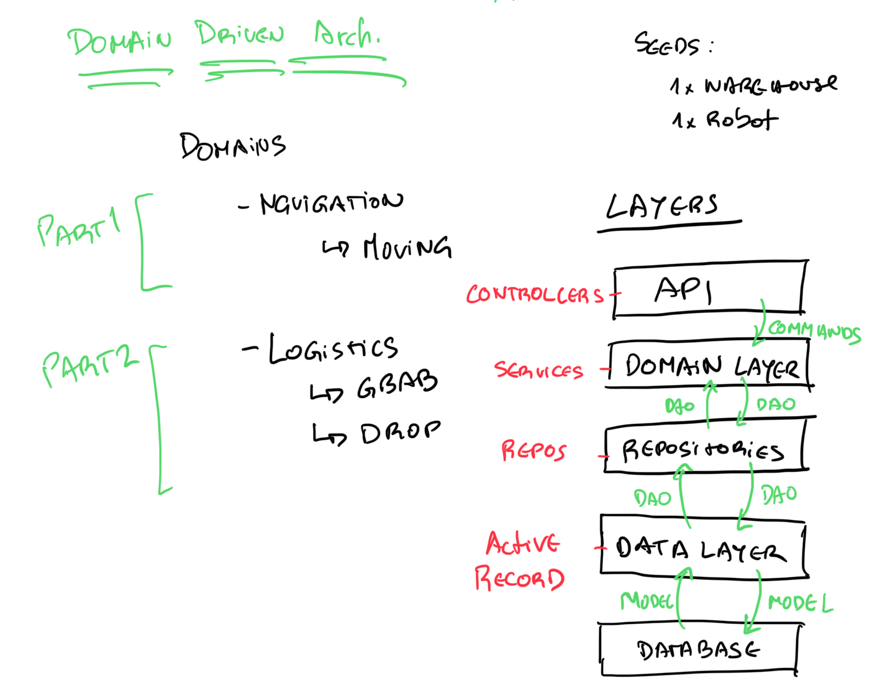

[](https://travis-ci.org/hugocore/curiosity-code-exercise)
[](https://codeclimate.com/github/hugocore/curiosity-code-exercise/maintainability)
[](https://codeclimate.com/github/hugocore/curiosity-code-exercise/test_coverage)
[](https://coveralls.io/github/hugocore/curiosity-code-exercise?branch=master)

# Curiosity - The tale of a warehouse robot

In this code exercise, I will work for NASA. They have high standards and strict safety requirements, so I won't be easey. Still, using Ruby on Rails they asked me to develop
a RESTful API that can move a robot inside a warehouse. This robot can lift
crates and move them from one place to another.

# Usage

Run this project with Docker:

```
docker-compose build
docker-compose run --rm web rake db:reset
docker-compose run --rm web rspec
```

Or, locally by creating an `.env` file with:

```
DB_HOST=...
DB_USER=...
DB_PASSWORD=...
```

And then running:

```
bundle install
RAILS_ENV=test rake db:create
rspec
```

# Code Quality

- Run rspec via Spring to speed up preloading with:

```
docker-compose run --rm web bash
bundle exec spring rspec
```

- Check test coverage locally:

```
open coverage/index.html
```

- A git commit hook runs Rubocop to validate changes, to skip it run:

```
SKIP=RuboCop git commit
```

- Travis makes sure the repo keeps building:

https://travis-ci.org/github/hugocore/curiosity-code-exercise

- Coveralls shows test coverage at:

https://coveralls.io/github/hugocore/curiosity-code-exercise

- Codeclimate checks code quality for every build at:

https://codeclimate.com/github/hugocore/curiosity-code-exercise

# The problem

NASA says:

> We have installed a robot in our Mars warehouse and now we need to be able to send it commands to control it. We need you to implement the control mechanism and expose it via an RESTful API.

> For convenience the robot moves along a grid in the roof of the warehouse and we have made sure that all of our warehouses are built so that the dimensions of the grid are 10 by 10. We've also made sure that all our warehouses are aligned along north-south and east-west axes.

> All of the commands to the robot consist of a single capital letter and different commands are dilineated by whitespace.

## Part One

The robot should accept the following commands:

* N move north
* W move west
* E move east
* S move south

### Example command sequences

The command sequence: "N E S W" will move the robot in a full square, returning it to where it started.

If the robot starts in the south-west corner of the warehouse then the following commands will move it to the middle of the warehouse.

"N E N E N E N E"

### Requirements

* (Req 1.) Create a way to send a series of commands to the robot
* (Req 2.) Make sure that the robot doesn't try to move outside the warehouse
* (Req 3.) Ensure that the robot's location is persisted (in the database)

## Part two

The robot is equipped with a lifting claw which can be used to move crates around the warehouse. We track the locations of all the crates in the warehouse.

Model the presence of crates in the warehouse. Initially one is in the centre and one in the north-east corner.

### Requirements

Extend the robot's commands to include the following:

* (Req 4.) G grab a crate and lift it
* (Req 5.) D drop a crate gently to the ground

There are some rules about moving crates:

* (Req 6.) The robot should not try and lift a crate if it already lifting one
* (Req 7.) The robot should not lift a crate if there is not one present
* (Req 8.) The robot should not drop a crate on another crate!

## Assumptions

- If given an invalid cardinal direction, the robot stays in the same place

- When trying to move a robot that doesn't exist, a 404 is returned

- Cardinal directions can be seperated by spaces or not

- Any other symbol used to describe a direction results in bad request

- Commands of movement and other operations are sent together

- Every command have a real-time effect, meaning that every command has an immidiate and synchronous result before the next

- When a sequence of commands contain a command that doesn't obey the rules or is invalid, it stops the sequence at that place to prevent damages

# Solution

Following the [c4model](https://c4model.com/) I will describe my solution from a
top-down approach, i.e. from Context, Containers, Components to Code.

## Context

This API is going to be used by external clients that communicate
through REST to send commands of string, e.g. "N E S W".

## Containers

To run the API a web server and an application server was required.
In this case, I decided to use *Ruby on Rails API* as my web framework for
simplicity and to get a web and application server up and running quickly.
The application server ('Ruby on Rails') persists data into a database running
PostgreSQL.

### Components



I wanted to achieve an architecture that would:
- allow the code to be easily maintained and continuously evolved
- loosely designed without dependencies between layers to facilitate future changes
- aligned with business rules that were incrementally added
- highly isolated to help keep high levels of testing coverage (picky NASA)
- easy to read and get to known, by just looking at the layers
- adhere to the SOLID principles and object composition

With these reasons in mind, I've decided to follow a *Domain-Driven Design*,
where the following layers are stacked together:

* API - Receives HTTP requests and passes down Command objects, that tell what
commands the robot must execute, to the domain layer.

* Domain layer - This layer keeps the logic that applies to the underlying
models, bounded in contexts about the many operations the system can do. Every
domain is composed of services, repositories and other classes that make sense
to be together and where a clear boundary of responsibility is defined. These are
the existing domains:

 * Control - "the brain" of the API, is able to parse and decide which actions
 to take based on incoming commands.

 * Navigation - movement control, defined in different systems, e.g. through
 cardinal directions. In the future is easy to plug another system and keep
 the same movement. A new controller service class would be required to depict
 to which navigation system a command applies to.

 * Operational - actions that the robot can perform. A controller service class
 is in place and delegate operational commands (grab and drop) to smaller services.
 Hence, separating concerns and keeping rules and logic split by action.

 * Repositories - mediators between the domain and data mapping layers, are crucial
 to support different data stores and abstract the domain from the data models.
 E.g. swapping ActiveRecord and PostgreSQL by another database like Redis to
 run the system in-memory would require just a new adaptor that respects the same
 interface.

* Data layer - Controls the data storage and data logic that depends on the
data management implementation chosen. To keep things simple in this project,
I've used ActiveRecord to manage the system's entities a.k.a data models.

* Database - Keeps the data stored. For simplicity, I've chosen PostgreSQL
due to its acceptable speed and easy to use. Another database, like Redis,
could have been used to optimize the system's speed.


More info at:

- https://medium.com/@slavakorolev/domain-driven-design-for-ruby-on-rails-d3dd4a606677
- https://github.com/paulrayner/ddd_sample_app_ruby
- https://github.com/Creditas/ddd-rails-sample

### Code

#### CommandsService

This service is the "brain" of the API. Without knowing exactly what each command
does, it's able to delegate commands to other domains that know what to do with them:

```ruby
    def parse_command(command)
      if Navigation::Commands::ALL.include? command
        :navigation_service
      elsif Operational::Commands::ALL.include? command
        :operational_service
      end
    end
```

It loops through the incoming commands and validates and delegates to services
that take them. In case an invalid command is passed, the execution stops
(like it was described in one of the assumptions). When that happens, based
on a feature flag, it either raises an error or logs the problem.

```ruby
commands.each do |command|
  break invalid_command_error(command, raise_errors) unless valid_command?(command)

  service = parse_command(command)

  public_send(service).call(robot_id: robot_id, commands: [command])
end
```

#### Registry

Perhaps one of the most pieces of code is the `Container` that keeps a registry
of all the repositories and services, allowing these to be auto-injected into
one another's. For instance:

```ruby
register(:robots_repo) { Repositories::Robots::ActiveRecordAdaptor.new }
```

Could easily swap the current robots repository from one adaptation
(here ActiveRecord) to another one, through logic or environmental variables.

Thus, we can compose objects together and decouple them from actual implementations.
It's also particularly useful when testing because it allows dependencies to be
stubbed in specs, preventing things like hitting databases or raising errors.

# Improvements

- Instead of using actual instances of the repositories in specs,
these could be stubbed so specs wouldn't interact with a database.
Making the tests run quicker and abstract the data layer implementation.

- Sequences could be dealt in a transaction to rollback in case
some command is invalid, but with many robots running it could become
tricky to control. An event-based architecture would be better to
cope with changes in real-time.

- Pass down Command objects from the API layer to the domain layer. This would
allow for parameters to be validated or computed.

- The `CardinalDirectionsService` could have been split in smaller
services that other navigation systems could re-use.

# Review

Take a look these pages to review this work:

- https://github.com/hugocore/curiosity-code-exercise/projects/1
- https://github.com/hugocore/curiosity-code-exercise/pulls?q=is%3Apr+is%3Aclosed
